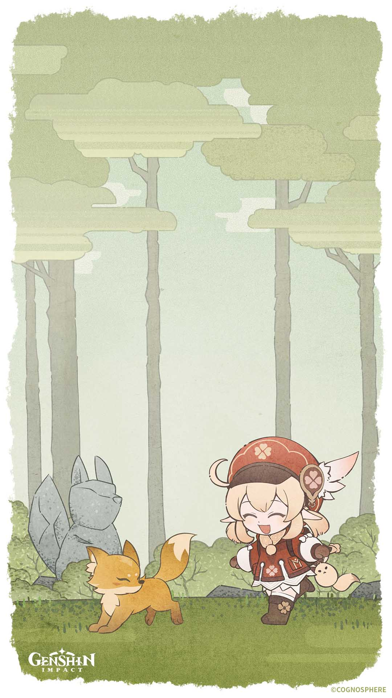

<h1> Hy, Its Me Andka! </h1>
<p> Enthusiast software developer from East Java, Indonesia! </p>


```ts
const andka = new Developer({
	code: ["Javascript", "Typescript", "PHP", "Python"],
	askMeAbout: ["web dev", "tech", "game", "animanga"],
	learning: "C++",
	technologies: {
		mobileApp: ["Kotlin", "Flutter"],
		frontEnd: {
			js: ["React", "Next", "Astro"],
			css: ["UnoCSS", "TailwindCSS"],
		},
		backEnd: {
			js: ["NodeJS", "Bun", "Express", "Fastify"],
			php: ["Laravel", "CodeIgniter", "Wordpress"],
		},
		databases: ["MongoDB", "MySQL", "PostgreSQL"],
	},
});
```

> <p align="center">      </p>

<p align="center">
    
    
</p>
