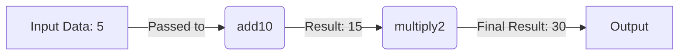
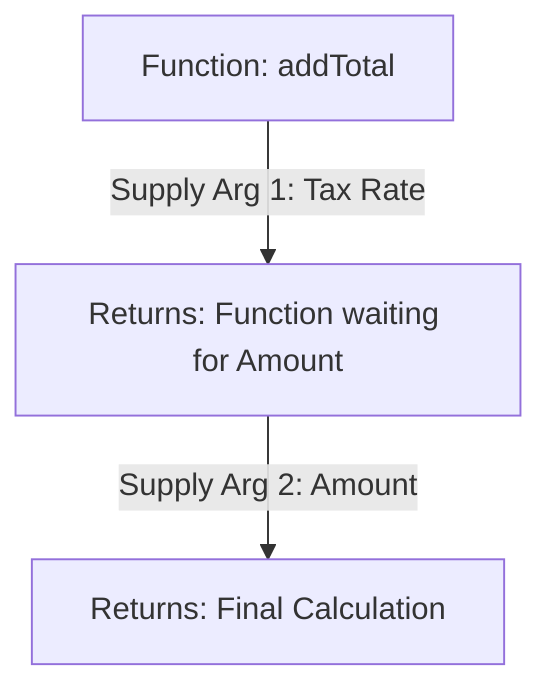
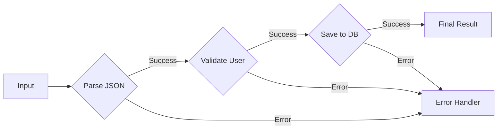

Functional Programming (FP) is a programming paradigm that focuses on writing code in a declarative way using pure functions and expressions. While it has roots in mathematical concepts, it can be applied practically in software development.

While the roots of FP lie in **Lambda Calculus** a formal mathematical system for defining computations using functions, you don’t need a math degree to use it. The philosophy is simple: treat computations as the evaluation of mathematical functions and avoid changing state and mutable data.

In this tour, we will look at _why_ developers choose this paradigm, the core concepts that define it, and the techniques that make it powerful.

---

## Why Consider Functional Programming?

One characteristic of functional programming is **predictability**. In many imperative systems, functions often depend on the hidden state of the application like variables defined elsewhere, global settings, or the current time. This can require developers to understand the entire state of the application to reason about a single block of code.

FP reduces this cognitive load. By isolating logic into functions that depend _only_ on their inputs, you can understand code behaviors in isolation. This creates a system that is inherently easier to test and debug because you don't have to replicate a complex application state to check if a function works.

Furthermore, the mathematical foundation of FP allows for safer refactoring. Because the code is built on **referential transparency** (expressions that can be replaced by their values without changing the program's behavior), you can optimize and move code around with a confidence that is often hard to achieve in imperative programming.

---

## The Core Concepts

Before we get into the complex techniques, we need to understand the ground rules. Functional programming is built on a few non-negotiable pillars: **Pure Functions**, **Immutability**, and **Declarative Style**.

### 1. Pure Functions and Referential Transparency

The heart of FP is the "pure function." A function is considered pure if it meets two criteria: it always produces the same output for the same input, and it has no side effects (it doesn't change anything outside of itself).

Consider a simple addition function:

```javascript
function add(a, b) {
  return a + b;
}
```

No matter how many times you call `add(2, 3)`, the result is always `5`. It doesn’t look at a database, it doesn't change a global variable, and it doesn't log to the console. This makes the code incredibly easy to reason about.

### 2. Immutability

In traditional programming, we often modify variables. We create an array and then `push` items into it. In FP, data is immutable. Once a data structure is created, it cannot be changed.

If you want to add an item to an array, you don't modify the old one; you create a new array that contains the old items plus the new one.

```javascript
// Imperative approach (Mutation)
let numbers = [1, 2, 3];
numbers.push(4); // The original 'numbers' array is now changed

// Functional approach (Immutability)
const numbers = [1, 2, 3];
const newNumbers = [...numbers, 4]; // A completely new array is created
```

While this might sound inefficient (copying arrays constantly), modern functional languages and libraries use a technique called **Structural Sharing**. They reuse the parts of the data that didn't change, making these operations surprisingly fast. The benefit is thread safety—you never have to worry that a background process changed your data while you were using it.

### 3. Functions as First-Class Citizens

In FP, functions are treated just like any other variable. You can pass them as arguments to other functions, assign them to variables, and return them from other functions. This allows for **Higher-Order Functions** like `map`, `filter`, and `reduce`, which let us express _what_ we want to do (declarative) rather than _how_ to do it (imperative).

---

## The Toolkit: Important Techniques

Once you understand the ground rules, you can start using the powerful techniques that FP offers to handle complex logic.

### Function Composition

Composition is the act of combining simple functions to build complex ones. It is the software equivalent of an assembly line. Rather than writing one giant function that does ten things, you write ten small functions that do one thing, and "compose" them together.



In code, this looks much cleaner than nesting functions inside one another:

```javascript
const transform = compose(multiply2, add10);
transform(5); // 30
```

This encourages the "Separation of Concerns" principle. You can test `add10` and `multiply2` individually, and if they work, you can trust that their composition works too.

### Currying and Partial Application

Currying transforms a function that takes multiple arguments into a sequence of functions that each take a single argument. This allows you to "pre-load" a function with specific configuration data.

Think of it as a funnel where you supply arguments one by one:



```javascript
const adder = (taxRate) => (amount) => amount + amount * taxRate;
const addVAT = adder(0.2); // We now have a specialized function just for VAT
console.log(addVAT(100)); // 120
```

This technique, known as partial application, creates highly reusable utility functions specialized for specific tasks without rewriting logic.

### Recursion

Since FP relies on immutability, we generally avoid loop counters (like `i++`). Instead, we use recursion, where a function calls itself with updated arguments until a "base case" is reached. While recursion is elegant, it can be memory-intensive. Many functional languages utilize **Tail Call Optimization**, a feature where the compiler optimizes recursive calls to prevent stack overflow errors, making recursion as efficient as a standard loop.

### Monads and Error Handling

This is often the most confusing part of FP, but it is essentially about **safety boxes**. In standard programming, if a value might be `null`, you have to write `if (value !== null)` checks everywhere. In FP, we wrap that value in a container (often called a Monad, like `Maybe` or `Either`).

A great way to visualize this is the **Railway Pattern**. You have a "Happy Path" (Success) and a "Failure Path" (Error). If an error occurs, the data switches tracks to the failure path, bypassing all subsequent operations safely.



Instead of checking for null manually, you apply functions to the container (Lifting). If the value is on the "Success" track, the function runs. If it's on the "Error" track, the function is skipped.

```javascript
// Pseudo-code for the Railway pattern
Maybe.of(jsonString)
  .map(parseJson) // Only runs if string is valid
  .map(validateUser) // Only runs if parse succeeded
  .getOrElse("Error"); // Returns error if any step failed
```

---

## When to Use Functional Programming?

Functional programming has different strengths and trade-offs compared to other paradigms. It can be well-suited for scenarios involving **complex data transformations**, where data flows through a series of steps (like ETL pipelines).

It may also be beneficial for **concurrent and parallel systems**. Because FP enforces immutability, race conditions where two threads try to update the same variable simultaneously are avoided by design.

Additionally, it can be applied to **critical business logic** where correctness and testability are important. The strict rules of FP encourage code that is loosely coupled and easier to test in isolation.

## Tools and Libraries

If you are working in JavaScript, you don't have to switch languages to start using FP. Libraries like **Ramda**, **Lodash/fp**, and **Sanctuary** provide the utility functions (like `compose`, `curry`, and `lens`) needed to write in a functional style.

For those looking to dive deeper, languages like **Elm** (frontend), **Haskell** (pure FP), and **Scala** or **F#** (hybrid) offer robust ecosystems to learn and apply these principles natively.

Functional programming represents a different approach to software design, with its own set of benefits and trade-offs that developers should consider based on their specific use case.
