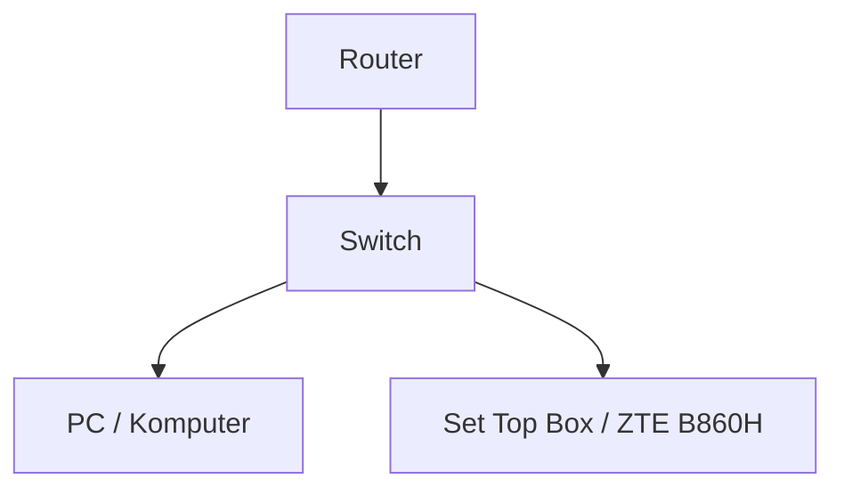

Dimulai dari sebuah rasa penasaran: "gimana caranya nyalain PC di rumah dari jauh?". Akhirnya aku pun membeli sebuah *set-top-box* ZTE B860H yang sudah terinstall Armbian — mesin mungil dengan RAM 2GB yang (spoiler) ternyata sanggup menjalankan lebih banyak hal dari yang aku kira.

Awalnya gak tau mau diisi apaan. Dia cuma diam aja, dipake buat nyalain PC lewat Wake-on-LAN. Tapi lama-lama terasa boring dan *wasteful* — masa mesin segini cuma buat tugas sesimpel itu? Akhirnya aku mulai iseng-iseng install ini itu, dan tanpa sadar jadi ketagihan. Mulai dari Pico Claw sampai AI gateway.

## Setup

Topologinya sebenernya sederhana banget:

Karena STB ini harus bisa diakses dari mana aja, aku pakai Cloudflare Tunnel untuk expose SSH ke internet. Jadi kalau lagi di luar dan butuh akses ke PC, tinggal SSH masuk lewat tunnel, terus kirim command WOL. Simpel, tapi efektif.

## Fase 1: Wake-on-LAN

Motivasi awalnya sederhana — aku pengen bisa nyalain PC dari mana aja tanpa harus pulang dulu, karena kenapa tidak? Biar bisa remote gaming kan. Udah setup Chrome Remote Desktop, Tailscale (Cloudflare Tunnel sudah kepake), dan Sunshine sebagai game streaming server. Tapi ternyata hasilnya gak sesuai harapan. Latensinya terlalu tinggi untuk game RPG yang lagi aku mainin, dan akhirnya proyek ini mangkrak beberapa bulan.

Tapi setelah beberapa waktu, rasanya *wasteful* banget punya mesin yang nyala terus tapi cuma nganggur. Dari situ mulailah eksperimen-eksperimen berikutnya.

## Fase 2: AI Assistant (yang Gak Bertahan Lama)

Hal pertama yang aku coba tambahkan adalah **[Pico Claw](https://picoclaw.io/)**, sebuah personal AI assistant — beda ya sama **[OpenClaw](https://openclaw.ai/)**, meski namanya mirip. Aku pilih ini karena ukurannya kecil dan gak makan banyak memori. Tapi lagi-lagi hasilnya kurang memuaskan; ada cukup banyak bug yang aku sendiri kurang punya waktu buat benerinnya, dan aku juga bingung mau kasih perintah apa. Akhirnya dihentikan.

## Fase 3: Eksperimen CasaOS (yang Juga Gak Bertahan)

Setelah bersihin sisa-sisa eksperimen sebelumnya, aku coba install **CasaOS** — sebuah home cloud OS yang punya antarmuka bagus untuk mengelola Docker container. Sempat menarik, tapi PostgreSQL yang aku butuhkan untuk salah satu service ternyata gak bisa jalan dengan benar di setup ini. Daripada debugging tanpa kejelasan, akhirnya CasaOS beserta Docker-nya diuninstall. Bersih lagi.

## Fase 4: Torrent Downloader + NAS

Karena males download torrent pakai HP, aku putuskan setup **qBittorrent** di STB ini. Ditambah HDD eksternal 1TB biar storage-nya gak sesak, dan voilà — punya dedicated torrent machine yang jalan 24/7.

Tapi ada masalah: bot Telegram untuk kontrol qBittorrent yang aku temukan ditulis pakai Python, dan terasa cukup berat untuk STB mungil dengan RAM 2GB ini.

Solusinya? Rewrite ke Rust.

Lahirlah **[Magpie](https://github.com/xirf/Magpie)** — rewrite dari bot tersebut yang jauh lebih ringan, plus support Discord selain Telegram. Alasannya murni soal performa: Rust punya *memory footprint* yang jauh lebih kecil dibanding Python, dan di mesin dengan resource seterbatas ini, setiap megabyte RAM itu berarti. Beneran sekecil itu — di peak usage dia cuma makan **<50MB**.

Setelah Magpie jalan, aku juga tambahkan **RustFs** dan di-expose ke internet, jadi hasil download bisa langsung diakses via browser tanpa perlu SSH atau transfer manual. Bonusnya, karena HDD 1TB udah nancep, aku sekalian setup NAS kecil-kecilan — lumayan buat backup file penting.

## Fase 5: AI Gateway

Setelah torrent downloader berjalan mulus, aku mulai kepikiran: kenapa gak sekalian bikin AI gateway? Ide awalnya adalah pakai **[9router](https://github.com/9router/9router)**, tapi Node.js-nya terasa terlalu berat — pola yang sama seperti Python di fase sebelumnya.

Solusinya, ya, rewrite ke Rust lagi.

Lahirlah **[Switchit](https://github.com/xirf/switchit)**. AI gateway yang *theoretically works*. Masih ada beberapa bug di sana-sini, tapi fungsi intinya sudah berjalan: routing request ke berbagai AI provider lewat satu endpoint unified.

Switchit jalan sebagai systemd daemon, jadi bisa auto-start saat STB dinyalakan dan berjalan di background tanpa perlu login. Satu-satunya kekurangan yang masih aku rasain: manajemennya masih berbasis file konfigurasi, jadi kalau mau ngedit sesuatu harus ngerti format config-nya — yang aku sendiri akui cukup ribet. Mungkin suatu saat bakal diubah biar lebih user-friendly.

## Refleksi

Kalau dipikir-pikir, perjalanan homelabbing ini ternyata lebih seru dari yang aku bayangkan. Mulai dari WOL sederhana, sempat mampir ke AI assistant dan CasaOS yang gak jadi, lalu akhirnya settle di torrent downloader, NAS, dan AI gateway — semuanya berjalan di atas satu STB kecil dengan RAM 2GB yang sekarang masih sisa banyak banget.

Yang paling menarik buatku adalah pola yang muncul: tiap kali ada tools yang terasa terlalu berat, jawabannya selalu rewrite ke Rust. Dan sejauh ini, strategi itu selalu berhasil.

> **PS:** Gw gabisa rust njir — kode Rust di sini ditulis dengan bantuan AI. Penting jadi dan jalan dulu jadi pake AI aja biar lebih cepat. But hey, kalau hasilnya jalan, ringan, dam sesuai kebutuhanku gak ada salahnya kan?

Homelab ini masih jalan sampai sekarang, dan kemungkinan bakal ada hal-hal baru yang ditambahkan lagi. Entah itu monitoring stack, reverse proxy yang lebih proper, atau eksperimen lain yang belum kepikiran. Kita lihat saja nanti.
