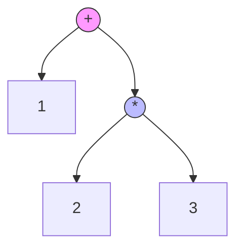
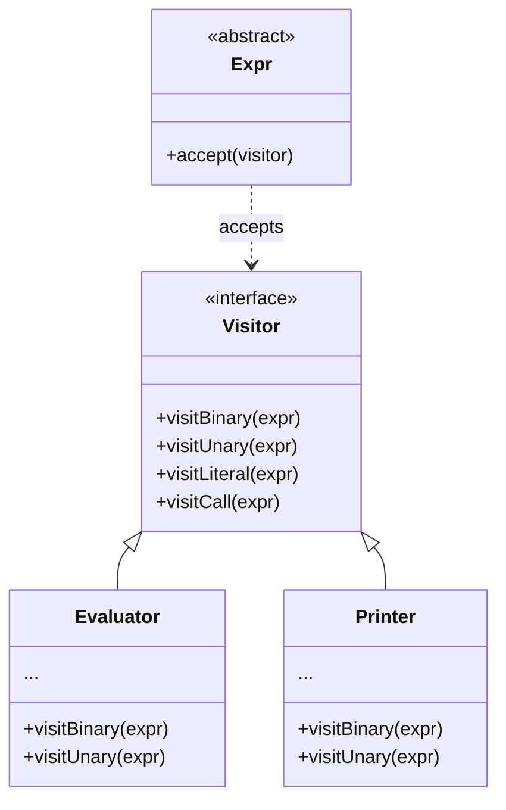

Whenever you type `1 + 2/3 - (-1) * (1 + sqrt(12/2))` into a console or calculator, a surprising amount of machinery whirs into motion. The computer doesn't "see" math; it sees a string of characters. To calculate the result, it must recognize numbers, understand grammatical relationships, and traverse a tree structure to compute a value.

In this post, we will:

1. **Tokenize** raw text into meaningful symbols.
2. **Parse** those symbols into an **Abstract Syntax Tree (AST)**.
3. **Evaluate** the tree using the **Visitor Pattern**, a powerful design pattern that separates algorithms from data structures.

---

## 1. Lexical Analysis (The Tokenizer)

Before we can understand the _structure_ of the math, we need to break the string into "words" or **tokens**.

We need to identify:

- **Numbers:** `1`, `12.5`
- **Operators:** `+`, `-`, `*`, `/`
- **Parentheses:** `(`, `)`
- **Functions:** `sqrt`, `sin`, or symbols like `√`

Here is a concise lexer using a "sticky" Regular Expression (`y` flag) to scan the string efficiently.

```javascript
const TOKEN_TYPES = {
  NUMBER: "NUMBER",
  OP: "OPERATOR",
  FUNC: "FUNCTION",
  EOF: "EOF",
};

function* lexer(input) {
  // Regex matches: Numbers | Operators | Identifiers (for functions)
  const re = /\s*(?:(\d+(?:\.\d+)?)|([+\-*/()^])|([a-zA-Z√]+))/gy;
  let match;

  while ((match = re.exec(input)) !== null) {
    if (match[1])
      yield { type: TOKEN_TYPES.NUMBER, value: parseFloat(match[1]) };
    else if (match[2]) yield { type: TOKEN_TYPES.OP, value: match[2] };
    else if (match[3]) yield { type: TOKEN_TYPES.FUNC, value: match[3] };
  }
  yield { type: TOKEN_TYPES.EOF };
}
```

---

## 2. The Abstract Syntax Tree (AST)

To effectively use the **Visitor Pattern**, we should move away from simple JavaScript objects and define **Classes** for our AST nodes. Each node will represent a grammatical construct (like a binary operation or a literal number).

Crucially, every node will have an `accept(visitor)` method. This is the entry point for our Visitor.

```javascript
// Base class for all expressions
class Expr {
  accept(visitor) {
    throw new Error("accept() not implemented");
  }
}

class Binary extends Expr {
  constructor(left, operator, right) {
    super();
    this.left = left;
    this.operator = operator;
    this.right = right;
  }

  accept(visitor) {
    return visitor.visitBinary(this);
  }
}

class Unary extends Expr {
  constructor(operator, right) {
    super();
    this.operator = operator;
    this.right = right;
  }

  accept(visitor) {
    return visitor.visitUnary(this);
  }
}

class Literal extends Expr {
  constructor(value) {
    super();
    this.value = value;
  }

  accept(visitor) {
    return visitor.visitLiteral(this);
  }
}

class Call extends Expr {
  constructor(callee, arg) {
    super();
    this.callee = callee; // e.g., "sqrt"
    this.arg = arg; // The expression inside ()
  }

  accept(visitor) {
    return visitor.visitCall(this);
  }
}
```

### Visualizing the Tree

If we parse the expression `1 + 2 * 3`, we don't get a linear list. We get a tree where `*` has higher precedence (is deeper in the tree) than `+`.



---

## 3. The Parser (Recursive Descent)

Now we build the parser. We will use **Recursive Descent**, a top-down approach where every rule in our grammar becomes a function (`expression`, `term`, `factor`).

_Note: Instead of returning plain objects, we now instantiate the Classes we defined above._

```javascript
class Parser {
  constructor(tokens) {
    this.tokens = tokens[Symbol.iterator]();
    this.current = null;
    this.advance(); // Load first token
  }

  advance() {
    this.current = this.tokens.next().value;
  }

  parse() {
    return this.expression();
  }

  // Expression: Handles + and -
  expression() {
    let left = this.term();

    while (this.current.value === "+" || this.current.value === "-") {
      const operator = this.current.value;
      this.advance();
      const right = this.term();
      left = new Binary(left, operator, right);
    }
    return left;
  }

  // Term: Handles * and /
  term() {
    let left = this.factor();

    while (this.current.value === "*" || this.current.value === "/") {
      const operator = this.current.value;
      this.advance();
      const right = this.factor();
      left = new Binary(left, operator, right);
    }
    return left;
  }

  // Factor: Handles Unary operators, Numbers, and Parentheses
  factor() {
    // Handle Unary (-5, +5)
    if (this.current.value === "-" || this.current.value === "+") {
      const operator = this.current.value;
      this.advance();
      const right = this.factor();
      return new Unary(operator, right);
    }

    return this.primary();
  }

  primary() {
    const token = this.current;

    if (token.type === TOKEN_TYPES.NUMBER) {
      this.advance();
      return new Literal(token.value);
    }

    if (token.type === TOKEN_TYPES.FUNC) {
      const name = token.value;
      this.advance();
      // Expect '('
      if (this.current.value !== "(")
        throw new Error("Expected '(' after function");
      this.advance();
      const arg = this.expression();
      // Expect ')'
      if (this.current.value !== ")") throw new Error("Expected ')'");
      this.advance();
      return new Call(name, arg);
    }

    if (token.value === "(") {
      this.advance();
      const expr = this.expression();
      if (this.current.value !== ")") throw new Error("Expected ')'");
      this.advance();
      return expr;
    }

    throw new Error(`Unexpected token: ${token.value}`);
  }
}
```

---

## 4. Enter the Visitor Pattern

This is where the Visitor Pattern provides its key benefits.

In a traditional procedural approach, you might write one giant `evaluate(node)` function with a massive `switch` statement checking `node.type`.

**The Problem:** If you want to add a new feature—say, "Convert AST to Lisp code" or "Pretty Print"—you have to modify that core function or write a new giant switch statement. Your logic gets scattered.

**The Solution:** The Visitor Pattern allows us to group related operations together.

1. The **Data** (AST Classes) owns the structure.
2. The **Visitor** (Evaluator, Printer) owns the logic.

### The Visitor Architecture



### Implementing the Evaluator Visitor

Now, calculating the math is just one implementation of a Visitor.

```javascript
class Evaluator {
  visitBinary(expr) {
    const left = expr.left.accept(this);
    const right = expr.right.accept(this);

    switch (expr.operator) {
      case "+":
        return left + right;
      case "-":
        return left - right;
      case "*":
        return left * right;
      case "/":
        return left / right;
      default:
        throw new Error(`Unknown operator: ${expr.operator}`);
    }
  }

  visitUnary(expr) {
    const right = expr.right.accept(this);
    switch (expr.operator) {
      case "-":
        return -right;
      case "+":
        return right;
      default:
        throw new Error(`Unknown unary: ${expr.operator}`);
    }
  }

  visitLiteral(expr) {
    return expr.value;
  }

  visitCall(expr) {
    const arg = expr.arg.accept(this);
    const func = Math[expr.callee] || Math[expr.callee.toLowerCase()];

    if (!func) throw new Error(`Unknown function: ${expr.callee}`);
    return func(arg);
  }
}
```

### Benefits of this approach

To demonstrate the flexibility, consider a scenario where we want to debug our parser by converting the math back into a Lisp-style string (Prefix notation). We don't need to modify the parser or the AST classes—we simply create a new Visitor:

```javascript
class LispPrinter {
  visitBinary(expr) {
    return `(${expr.operator} ${expr.left.accept(this)} ${expr.right.accept(this)})`;
  }
  visitUnary(expr) {
    return `(${expr.operator} ${expr.right.accept(this)})`;
  }
  visitLiteral(expr) {
    return expr.value.toString();
  }
  visitCall(expr) {
    return `(${expr.callee} ${expr.arg.accept(this)})`;
  }
}
```

---

## 5. Putting It All Together

Let's run the whole pipeline with a complex equation.

```javascript
const input = "1 + 2/3 - (-1) * (1 + sqrt(12/2))";

// 1. Lexing
const tokens = [...lexer(input)];

// 2. Parsing
const parser = new Parser(tokens);
const ast = parser.parse();

// 3. Evaluation (Visitor 1)
const evaluator = new Evaluator();
const result = ast.accept(evaluator);

// 4. Debug Printing (Visitor 2)
const printer = new LispPrinter();
const lispStr = ast.accept(printer);

console.log(`Input:  ${input}`);
console.log(`Lisp:   ${lispStr}`);
console.log(`Result: ${result}`);
```

**Output:**

```text
Input:  1 + 2/3 - (-1) * (1 + sqrt(12/2))
Lisp:   (- (+ 1 (/ 2 3)) (* (- 1) (+ 1 (sqrt (/ 12 2)))))
Result: 5.116156409449845

```

## Conclusion

This post demonstrated the process of transforming a raw string of characters into a fully evaluated numeric result.

By combining **Recursive Descent Parsing** with the **Visitor Pattern**, we created a system that separates data structures from operations. If you need to add new functionality—such as a compiler that turns math into Assembly code—you can do so by writing a new Visitor without modifying the parser.

This pattern is used in many real-world interpreters and compilers.
